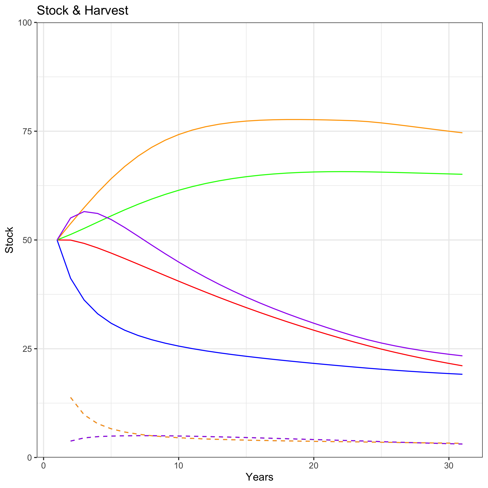
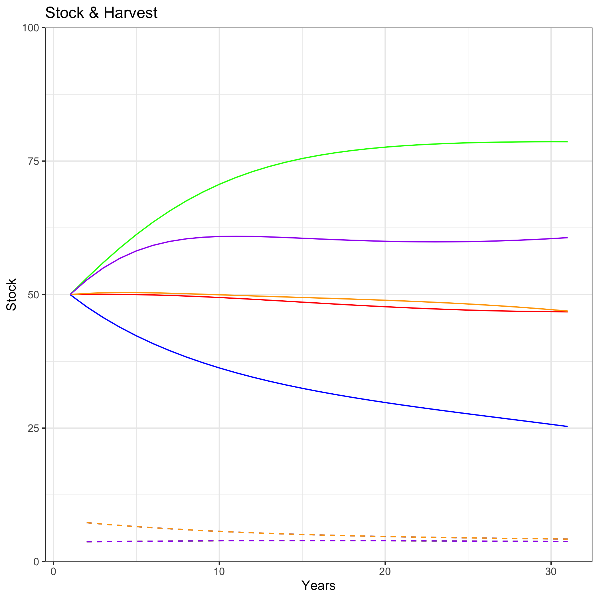
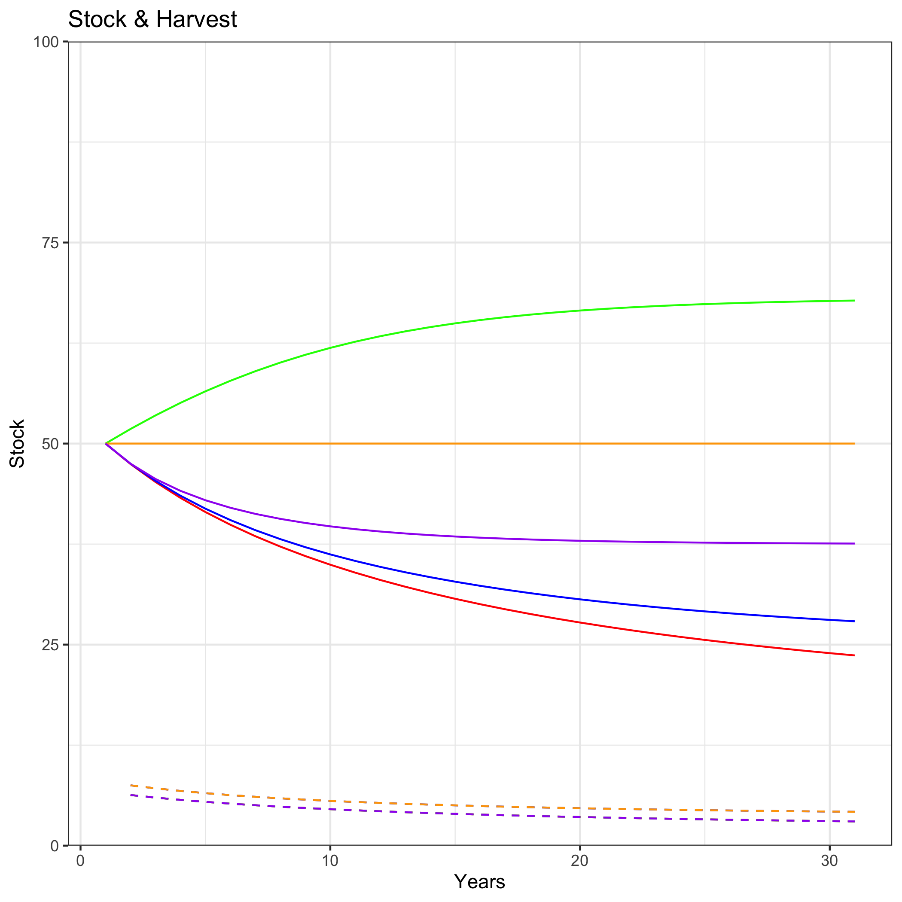
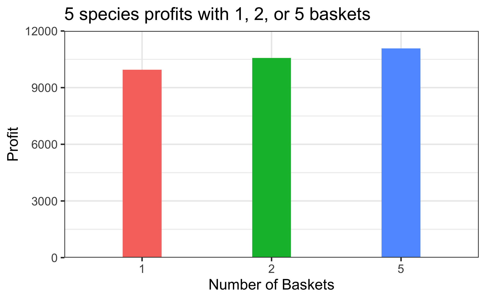

```{r setup, include=FALSE}
knitr::opts_chunk$set(echo = TRUE)
```

## Updated results from the Faculty Review


### Model updates

#### Allowed our model to input a different harvest limit for each basket.

#### Added a harvest optimization step for each basket.

- For our results, we assumed that to compare Quota Baskets to optimal single species (or global) management, we'd be comparing optimal basket harvests. So, we wrote a script to run our QB model over every combination of basket mortalities from 0.1~0.6 or so. 

- Our harvests generally end up at $avg(r)/2$, which is anywhere from 0.1-0.3. 

- However, some basket mortality combos give `solve.QP` an error, "NA/inf/-inf in matrix" or something. We think it's caused by a rounding error that makes some parameter 0 with very low or very high mortalities, but TBD. Generally, these errors don't interfere with values near the optimal harvest, and just occur when we run everything from 0.01-0.99. 

- We'd like to optimize this step using `optim()` or something else. If you know of anything, let us know - I've looked at `optim()` briefly and it's not clear it will work. Otherwise, optimizing for every mortality combo for 5 baskets takes ~1-2 hours parallel processed.

#### Wrote a script to solve every basket combination 

- We just had time to run this for each possible 2 basket combo for our 5 species model. These take a long time - each combo must also be optimized for harvest as per above. Can we speed it up?

- Some basket combos gave us errors, so this is most (but not all) year 30 biomasses in baskets. 


#### Ran a 5 species scenario for the following parameters:

We used the following parameters for our 5 species run:

```{r}
# Species:
# s = species, r, K, X, p
s1 <- c(s=1, r=0.15, K=100, X=50, p=8) 
s2 <- c(s=2, r=0.2, K=100, X=50, p=12)
s3 <- c(s=3, r=0.2, K=100, X=50, p=8)
s4 <- c(s=4, r=0.3, K=100, X=50, p=10)
s5 <- c(s=5, r=0.4, K=100, X=50, p=12)


# t = tech, q1 = catchability species 1, q2 = catchability species 2...
t1 <- c(t=1, q1=0.04, q2=0.01, q3=0.01, q4=0.01, q5 = 0.1)
t2 <- c(t=2, q1=0.01, q2=0.04, q3=0.01, q4=0.01, q5 = 0.01)
t3 <- c(t=2, q1=0.01, q2=0.01, q3=0.04, q4=0.01, q5 = 0.01)
t4 <- c(t=2, q1=0.01, q2=0.01, q3=0.01, q4=0.04, q5 = 0.01)
t5 <- c(t=2, q1=0.01, q2=0.01, q3=0.01, q4=0.01, q5 = 0.04)


# Tech cost: t = tech, cost = cost per unit effort
c1 <- c(t=1, cost=1)
c2 <- c(t=2, cost=1)
c3 <- c(t=3, cost=1)
c4 <- c(t=4, cost=1)
c5 <- c(t=5, cost=1)
```

And ran it for 1, 2, and 5 species. Nate's code for optimal single species management was returning lower net profits over 30 years for single species management than the two basket scenario, so we ran our model for 5 species and got better results. We think this is because we're not quite hitting steady states at year 30, so Nate's code underfishes compared to the optimal model results.

Our takeaways from this are that we *can* shift fishing behavior with a quota basket - the species targeted shift when we move from 1 to 2 baskets. 










Profits give a nice result, too, with 2 baskets falling right between 1 and 5. We have not considered discounting at all in any of these analyses - we should talk about whether discounting makes sense.

Presumably, different 2 basket combos will return different net profits: running all of these should be easy and give a relatively interesting picture of variance.



### Major model questions:

- Is there a faster way to solve for optimal harvest for each basket?
- Can we troubleshoot solve.QP to run all biomasses? Is it necessary?
  - We also plan to update the model to selectively exclude errors and keep runnning, but didn't have the capacity to set that up before the review.


### Next steps: Turning our model into results

We'd like to get your feedback on how to use our model to really reinforce Quota Baskets as a concept in our report. We have a few ideas on how to do this.

##### Quantifying when or not a quota basket works

- Steve Gaines pointed out that general "rules of thumb" for quota baskets would be nice. He suggested it in the context of "given 150 species, how many quota baskets should I implement?"

- Our thoughts are that we can quantify average (economic? biological?) improvement from 1-5 baskets and see if there's a trend. We don't have costs built into our model, so it's maybe impossible to say exactly how many baskets work for any scenario - more baskets = more monitoring, enforcement, research.

- We were also thinking about categorizing species or species groups into risk categories - somewhat like the Pacific Groundfish Fishery does - and creating (or adapting) a metric for susceptibility that can inform quota basket choice. Basically, ranking species traits that make a species more or less susceptible (low r, low K, high q, high P) and finding some sort of cumulative susceptability. This is a half thought out idea of quantifying the answer to "when does a quota basket work?" - and maybe we just won't be able to get there - but we'd love your ideas.

- In a similar vein, we considered running a whole bunch of species with different parameters and trying to group successful/unsuccessful quota baskets and glean something from these. The problem is that there's maybe too many variables to do this well - each species has an r, K, P, etc. but the basket success is determined by the other species in that basket too. Could running a bunch of simulations and then using a PCA or clustering method be useful for this?

##### How to choose a quota basket:
- We're just assuming a manager will perfectly optimize their quota basket for max profit in our model up until now. We plan on addressing (in words, not analysis) this assumption in our discussion - and talking about theoretical scenarios of how to optimize for other goals. Is this sufficient? Should we try and optimize for a food security (max biomass) or conservation (many options...high limits on overfished species) goals?

