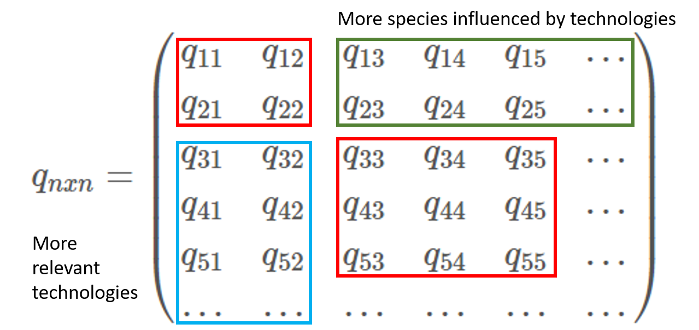

**This Rmd shows our efforts for the maximization process year by year. Instead of finding the max PVNB over the study period, we will do maximization from the fishermen perspective, which is to maximize the profit of the current year. Then use the stock dynamic result from this year to guide the fishing behavior for next year.**

### Abstract

1. No solution for linear cost situation

2. If we set the parameters as in Section I, then the best E for grouping with fishing effort (QB_E) and grouping with harvest (QB_H) will be:<br>

$$
\begin{pmatrix}
{V\beta_2\over (\beta_1 + \beta_2)}\\
{V\beta_1\over (\beta_1 + \beta_2)}
\end{pmatrix}_{QB_E},
\begin{pmatrix}
{\beta_2H\over 0.0045(\beta_1+\beta_2)} \\
{\beta_1H\over 0.0045(\beta_1+\beta_2)}\\
\end{pmatrix}_{QB_H}
$$


3. The general form (no presumed value for any parameters) of E for QB_E is (equation for QB_H is too long to type it here):<br>

$$
\begin{pmatrix}
{2\beta_2V+p_1X0_1(q_{11}-q_{21})-p_2X0_2(q_{12}-q_{22})\over 2\beta_1+2\beta_2}\\
{2\beta_1V-p_1X0_1(q_{11}-q_{21})+p_2X0_2(q_{12}-q_{22})\over 2\beta_1+2\beta_2}
\end{pmatrix}_{QB_E}
$$

4. The greatest challenge for the QB approach is the capability to arrange the species groups in many ways. 

A *potential solution* is to run the code for each QB arrangement, however this approach present the obstacle that the technology-species array: (i). it can ignore the effect of on other species, and (ii). it can ignore that multiple technologies and efforts are used to harverst an specific species. All depends on how the array is defined and arranged.

### Section I: Set Parameters (Simple model)
```{r setup, include=FALSE}
knitr::opts_chunk$set(echo = FALSE, message=F, warning=F)

# Packages
library(tidyverse)
library(Matrix)
library(kableExtra)
library(ggplot2)
library(plotly)
library(lpSolve)
library(lpSolveAPI)
library(ggpubr)
library(tinytex)
```

```{r} 
# First, set seed to ensure we have the same result 
set.seed(666)


# set the number of species and technologies we want to study
species_num <- 2
tech_num <- 2


# set the number of years we want to model the stock dynamic 
year = 3

# set the discount rate
delta = 0.05
rho = 1/(1+delta)


# set parameters
species <- c(1:species_num)
parameter <- data.frame(species)
parameter$r <- c(1,1)
parameter$K <- c(1,1)
parameter$X0 <- c(0.5,0.5)
parameter$p <- c(200,200)
parameter$delta <- c(0.05,0.05)
parameter$rho <- 1/(1+parameter$delta)

# set catchability coefficient 
coefficient <- c(0.05,0.04,0.04,0.05)
q_matrix <- matrix(coefficient, nrow = tech_num, ncol = species_num, byrow=T)

# set effort for each tech 
E <- c(0.5,0.5)

# set cost for each tech
C <- c(1,1)
```

We will keep our model simple. We created a model of `r tech_num` technologies and `r species_num` species for a study period of `r year` years. The price of fish depends on species (we will add in more attributes later).

```{r}
# print the parameter table
par <- kbl(parameter, caption = "Species Parameters") %>% 
  kable_classic(full_width = F, html_font = "Cambria")
par
```

```{r}
# q_matrix <- matrix(coefficient, nrow = tech_num, ncol = species_num)
species_tech_matrix <- data.frame(q_matrix)

# assign column and row names to the matrix
matrix_col_name <-  paste("species", 1:species_num, sep = " ")
colnames(species_tech_matrix) <- matrix_col_name
matrix_row_name <-  paste("tech", 1:tech_num, sep = " ")
rownames(species_tech_matrix) <- matrix_row_name
```

```{r}
# print the catchability table 
matrix_table = kbl(species_tech_matrix, caption = "Catchability Matrix") %>% 
  kable_classic(full_width = F, html_font = "Cambria")
matrix_table
```

We will evaluate this simple model under a linear and a exponential cost.

### Section I.1: Maximize Profit for linear cost (Simple model)

Since we are doing optimization year by year, let's see how the first year goes. 
<br>

##### **Profit Equation (linear cost):**

$$\pi = \sum_{i=1}^{techNum}[(\sum_{j=1}^{speciesNum} p_j \times q_{i,j}E_iX_{j}) - C_iE_i]
$$<br>
<br>

Given $X0$ (initial stock size), the profit for the first year will be:

$$
(E_1, E_2)_{E}
\times 
\begin{pmatrix}
0.05&0.04\\
0.04&0.05\\
\end{pmatrix}_q
\times 
\begin{pmatrix}
200 \times 0.5\\
200 \times 0.5\\
\end{pmatrix}_{p \ \times \ X0}
-
(E_1, E_2)_{E}
\times 
\begin{pmatrix}
1\\
1\\
\end{pmatrix}_{C}
$$
$= (E_10.05+E_20.04)\times 100 + (E_10.04+E_20.05)\times 100 - (E_1 + E_2)$<br>
<br>
$= 5E_1 + 4E_2+4E_1+5E_2-E_1-E_2$<br>
<br>
$= 8E_1+8E_2$<br>
<br>

##### **Gradient:**

Let $f(E) = 8E_1+8E_2$, <br>

$$\nabla f(E) = 
\begin{pmatrix}
8\\
8\\
\end{pmatrix}_{Gradient}
$$<br>
<br>

When $\nabla f(E) = 0$,<br>
$$E = 
\begin{pmatrix}
0\\
0\\
\end{pmatrix}_{Gradient}
$$<br>

##### **Conclusion:**

**The calculation will stop right here, since the partial derivative for all the variables (E) are constants. This means profit will change at a constant rate at the direction of each of the variable. We don't need to look for maximun or mininum because this is a line (the endpoints are the max or mix.)**
<br>
<br>

**No solution for the linear cost case.**

<br>

### Section I.2: Maximize Profit for nonlinear cost (Simple model)

##### **Profit Equation (nonlinear cost):**

$$\pi = \sum_{i=1}^{techNum}[(\sum_{j=1}^{speciesNum} p_j \times q_{i,j}E_iX_{j}) - \beta_iE_i^2]
$$<br>


We chose the cost to be $\beta_iE_i^2$ because how quickly the cost increase is determined by $\beta$, and any power greater than 2 (i.e. $E^3, \ E^4...et \ al$) is not empirically seen in costs functions. 

Given $X0$ (initial stock size), the profit for the first year will be:<br>

$$
(E_1, E_2)_{E}
\times 
\begin{pmatrix}
0.05&0.04\\
0.04&0.05\\
\end{pmatrix}_q
\times 
\begin{pmatrix}
200 \times 0.5\\
200 \times 0.5\\
\end{pmatrix}_{p \ \times \ X0}
-
(E_1^2, E_2^2)_{E}
\times 
\begin{pmatrix}
{\beta_1}\\
{\beta_2}\\
\end{pmatrix}_{\beta}
$$

$$\begin{align}
&=(E_10.05+E_20.04)\times 100 + (E_10.04+E_20.05)\times 100 - (E_1^2{\beta_1} + E_2^2{\beta_2})\\
&= 9E_1+9E_2-E_1^2{\beta_1} - E_2^2{\beta_2}\\
\end{align}
$$<br>
<br>

##### **Gradient:**
Let $f(E) = 9E_1+9E_2-E_1^2{\beta_1} - E_2^2{\beta_2}$, <br>

$$\nabla f(E) = 
\begin{pmatrix}
9-2\beta_1E_1\\
9-2\beta_2E_2\\
\end{pmatrix}_{Gradient}
$$<br>
<br>

When $\nabla f(E) = 0$,<br>

$$
E=\begin{pmatrix}
9\over 2\beta_1\\
9\over 2\beta_2\\
\end{pmatrix}
$$
<br>
<br>

##### **Lagrange Multiplier (QB_E)**
Object function:
$$
f(E) = 9E_1+9E_2-E_1^2{\beta_1} - E_2^2{\beta_2}
$$
s.t. :
$$
E_1 + E_2 = V \longrightarrow E_1 + E_2 - V = 0
$$
<br>

Lagrange Multiplier:

$$\begin{cases}
L(E, \lambda) = f(E) + \lambda(E_1 + E_2 - V)\\
{\partial L \over \partial E_1} = 9-2\beta_1E_1+\lambda=0\\
{\partial L \over \partial E_2} = 9-2\beta_2E_2+\lambda=0\\
{\partial L \over \partial \lambda} = E_1+E_2-V=0\\
\end{cases}
$$

$$\begin{cases}
E_1 = {V\beta_2\over (\beta_1 + \beta_2)}\\
E_2 = {V\beta_1\over (\beta_1 + \beta_2)}
\end{cases}
$$

##### **In General (QB_E):**

Object function:
$$
f(E) = E_1(q_{11}p_1X0_1+q_{12}p_2X0_2) + E_2(q_{21}p_1X0_1+q_{22}p_2X0_2) - \beta_1E_1^2 - \beta_2E_2^2
$$
s.t.:
$$
E_1 + E_2 -V = 0
$$
We are employin X0 because we are maximizing for the first year.

<br>

Lagrange Multiplier:<br>

$$\begin{cases}
L(E, \lambda) = f(E) + \lambda(E_1 + E_2 - V)\\
{\partial L \over \partial E_1} = q_{11}p_1X0_1+q_{12}p_2X0_2-2\beta_1E_1 + \lambda=0\\
{\partial L \over \partial E_2} = q_{21}p_1X0_1+q_{22}p_2X0_2-2\beta_2E_2 + \lambda=0\\
{\partial L \over \partial \lambda} = E_1+E_2-V=0\\
\end{cases}
$$


$$\begin{cases}
E_1 = {2\beta_2V+p_1X0_1(q_{11}-q_{21})-p_2X0_2(q_{12}-q_{22})\over 2\beta_1+2\beta_2}\\
E_2 = {2\beta_1V-p_1X0_1(q_{11}-q_{21})+p_2X0_2(q_{12}-q_{22})\over 2\beta_1+2\beta_2}
\end{cases}
$$

<br>

##### **Lagrange Multiplier (QB_H)**
Object function:
$$
f(E) = 9E_1+9E_2-E_1^2{\beta_1} - E_2^2{\beta_2}
$$

s.t. :
$$
(0.05E_1 + 0.04E_2) \times X0_1 + (0.04E_1 + 0.05E_2) \times X0_2 = H
$$

<br>

Lagrange Multiplier:<br>

$$\begin{cases}
L(E, \lambda) = f(E) + \lambda(EqX0 - H)\\
{\partial L \over \partial E_1} = 9-2\beta_1E_1+0.045\lambda=0\\
{\partial L \over \partial E_2} = 9-2\beta_2E_2+0.045\lambda=0\\
{\partial L \over \partial \lambda} = 0.045E_1+0.045E_2-H=0\\
\end{cases}
$$

$$\begin{cases}
E_1 = {\beta_2H\over 0.0045(\beta_1+\beta_2)} \\
E_2 = {\beta_1H\over 0.0045(\beta_1+\beta_2)}\\
\end{cases}
$$

<br>

##### **In General (QB_H):**

Object function:
$$
f(E) = E_1(q_{11}p_1X0_1+q_{12}p_2X0_2) + E_2(q_{21}p_1X0_1+q_{22}p_2X0_2) - \beta_1E_1^2 - \beta_2E_2^2
$$
s.t.:
$$
E_1(q_{11}X0_1+q_{12}X0_2) + E_2(q_{21}X0_1+q_{22}X0_2) - H = 0
$$
<br>

Lagrange Multiplier:<br>

$$\begin{cases}
L(E, \lambda) = f(E) + \lambda(E_1(q_{11}X0_1+q_{12}X0_2) + E_2(q_{21}X0_1+q_{22}X0_2) - H)\\
{\partial L \over \partial E_1} = q_{11}p_1X0_1+q_{12}p_2X0_2-2\beta_1E_1 + \lambda (q_{11}X0_1+q_{12}X0_2)=0\\
{\partial L \over \partial E_2} = q_{21}p_1X0_1+q_{22}p_2X0_2-2\beta_2E_2 + \lambda (q_{21}X0_1+q_{22}X0_2)=0\\
{\partial L \over \partial \lambda} = E_1(q_{11}X0_1+q_{12}X0_2) + E_2(q_{21}X0_1+q_{22}X0_2) - H = 0\\
\end{cases}
$$

### Section II:  model 

Object function: 
$$
f(E) = E \cdot q \cdot (p \circ X0) - (E \circ E) \cdot \beta
$$

---

We need to be specific about our model before we proceed into deeper maximization. Our previous examples considered a squared array (2 species, 2 technologies) and one quota basket (1 constraint). In reality, the array does not need to be squared and we can face multiple constraints (quota baskets). 

For example, let suppose we have an array of 10 species and 10 technologies. The QBs can be arrange (assuming there are reasons behind these groups):

- A. Q(1,2), QB(3,7,8,9), QB(4,5,6), Q(10)
<br>
or
<br>
- B. Q(1,5), QB(2,3), QB(4,5), Q(6,7), Q(8,9), Q(10)

Both cases imply 10 efforts but 4 constraints in A and 6 constraints in B. Consequently, the general analytical solution and model code proves to be difficult, especially for different cost functions and multiple QB arrangements.

### Section II.1:  potential solution 

We assume the there is no interaction among species and baskets, thus a potential solution is to run the QB model for each QB. In that way, we maximize each time with 1 constraint.

For example,for 5 species, we can build 2 QB:

Array for species 1 and 2:
$$
QB_{1}=
\begin{pmatrix}
q_{11}&q_{12}\\
q_{21}&q_{22}\\
\end{pmatrix}
$$
Array for species 3,4 and 5:
$$
QB_{2}=
\begin{pmatrix}
q_{11}&q_{12}&q_{13}\\
q_{21}&q_{22}&q_{23}\\
q_{31}&q_{32}&q_{33}\\
\end{pmatrix}
$$
However, there are is an obstacle for this approach: **we are assuming an array where i=j**.

### Section II.2:  an obstacle for the potential solution

This solution approach assumes a square array when it does not need to be the case.
$$
q_{nxn}=
\begin{pmatrix}
q_{11}&q_{12}&q_{13}&q_{14}&q_{15}&...\\
q_{21}&q_{22}&q_{23}&q_{24}&q_{25}&...\\
q_{31}&q_{32}&q_{33}&q_{34}&q_{35}&...\\
q_{41}&q_{42}&q_{43}&q_{44}&q_{45}&...\\
q_{51}&q_{52}&q_{53}&q_{54}&q_{55}&...\\
...&...&...&...&...&...\\
\end{pmatrix}
$$
 Moreover, we ignore if more technologies are used for each species. 
 
 
 
 Howerver, the solution can carefully array built by the manager.
 <br>

### Section II.2:  hypothesis

In general, the hypothesis we want to test, in terms of biomass and profits, is:
<br>

**Global Quota < N arrangement of quota basket < single species quota**
