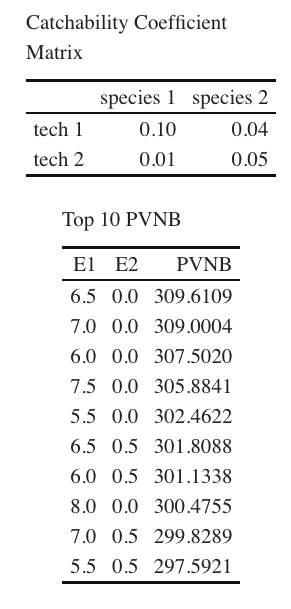
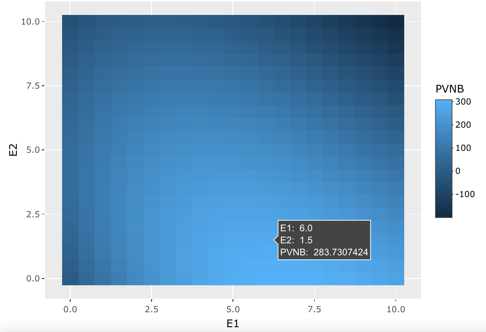
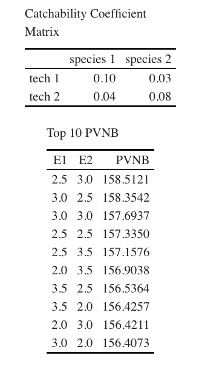

```{r setup, include=FALSE, warning=FALSE}
knitr::opts_chunk$set(echo = FALSE)

# Packages
library(tidyverse)
library(janitor)
library(Matrix)
library(kableExtra)
library(ggplot2)
library(plotly)
library(lpSolve)
library(lpSolveAPI)
```

```{r}
source("stock_dynamic.R")
source("harvest_species.R")
source("harvest_tech.R")
source("profit_tech.R")
source("pvnb.R")
```

<center>This Rmd is used for sensitivity analysis. I attached the screenshots of results from previous runs. You can make different sensitivity analysis using the code at the end.</center>

<br>

**1. Tech 1 and Tech 2 have different costs, and are good at targeting different species:**<br>

**1.1. Species 1 grows faster and has lower value**
- Species 1 grows faster and has a higher carrying capacity <br>(r1 = 1, r2 = 0.5; K1 = 1.5, K2 = 1); 
- Cost of tech 1 is lower than tech 2 <br>(C1 = 6, C2 = 10);
- price of species 2 is higher than species 1 <br>(p1 = 150, p2 = 400);
- Tech 1 is good at catching species 1, tech 2 is good at catching species 2;<br>

<center>{height=300};{height=300}</center>

<br>

**1.2. Species 1 grows faster and has higher value**
- Species 1 grows faster and has a higher carrying capacity <br>(r1 = 1, r2 = 0.5; K1 = 1.5, K2 = 1); 
- Cost of tech 1 is lower than tech 2 <br>(C1 = 6, C2 = 10);
- price of species 2 is higher than species 1 <br>(p1 = 150, p2 = 400);
- Tech 1 is good at catching species 1, tech 2 is good at catching species 2;<br>

<center>{height=300};{height=300}</center>

<br>
<br>

**2. Tech 1 and Tech 2 have the same costs, but are good at targeting different species:**

- Species 1 grows faster and has a higher carrying capacity <br>(r1 = 1, r2 = 0.6; K1 = 1.5, K2 = 1); 
- Cost of tech 1 is the same as tech 2 <br>(C1 = 8, C2 = 8);
- price of species 2 is higher than species 1 <br>(p1 = 150, p2 = 225);
- Tech 1 is good at catching species 1, tech 2 is good at catching species 2;<br>

<center>{height=300};{height=300}</center>


<br>
<br>

**3. Tech 1 and Tech 2 have the same costs, but are good at targeting different species:**

- Species 1 grows faster and has a higher carrying capacity <br>(r1 = 1, r2 = 0.6; K1 = 1.5, K2 = 1); 
- Cost of tech 1 is the same as tech 2 <br>(C1 = 8, C2 = 8);
- price of species 2 is higher than species 1 <br>(p1 = 150, p2 = 225);
- Tech 1 is good at catching species 1, tech 2 is good at catching species 2;<br>

<center>{height=300};{height=300}</center>
_______________________________________________


```{r}
species_num <- 2
tech_num <- 2
species <- c(1:species_num)
parameter <- data.frame(species)

parameter$r <- c(1,1)
parameter$K <- c(1,1)
parameter$p <- c(200,200)
parameter$X0 <- c(0.5,0.5)
parameter$c <- c(1,1)
parameter$delta <- c(0.05,0.05)

coefficient <- c(0.05,0.04,
                 0.04,0.05)
C <- c(1,1)
year = 5
delta = 0.05
rho = 1/(1+delta)

E_1 <- seq(0,15,0.5)
E_2 <- seq(0,15,0.5)
```

```{r}
q_matrix <- matrix(coefficient, nrow = tech_num, ncol = species_num)
species_tech_matrix <- data.frame(q_matrix)

matrix_col_name <-  paste("species", 1:species_num, sep = " ")
colnames(species_tech_matrix) <- matrix_col_name
matrix_row_name <-  paste("tech", 1:tech_num, sep = " ")
rownames(species_tech_matrix) <- matrix_row_name

matrix_table = kbl(species_tech_matrix, caption = "Catchability Coefficient Matrix") %>% 
  kable_classic(full_width = F, html_font = "Cambria")
matrix_table
```

```{r}
# generate all the E1 and E2 combinations
E_new <- NULL
for(i in 1:length(E_1)){
  for(j in 1:length(E_2)){
    E_new <- rbind(E_new, c(E_1[i], E_2[j]))
  }
}
```


```{r}
# plug in E1 and E2 to calculate PVNB
pvnb_vec <- NULL
for(i in 1:nrow(E_new)){
   tmp_E <- E_new[i,]
   tmp_pvnb <- pvnb(tmp_E)
   pvnb_vec <- append(pvnb_vec,tmp_pvnb)
}
E_new <- data.frame(E_new)
colnames(E_new) <- c("E1", "E2")
E_new$PVNB <- pvnb_vec
```

```{r}
E_top10 <- E_new %>% 
  arrange(-PVNB) %>% 
  head(10)


E_top10 = kbl(E_top10, caption = "Top 10 PVNB") %>%
  kable_classic(full_width = F, html_font = "Cambria")

E_top10
```


```{r}
# plot the distribution of pvnb under E1 and E2
pvnb_grid <- ggplot()+
  geom_raster(data = E_new,
              aes(x = E1, 
              y = E2,
              fill= PVNB))

ggplotly(pvnb_grid)
```